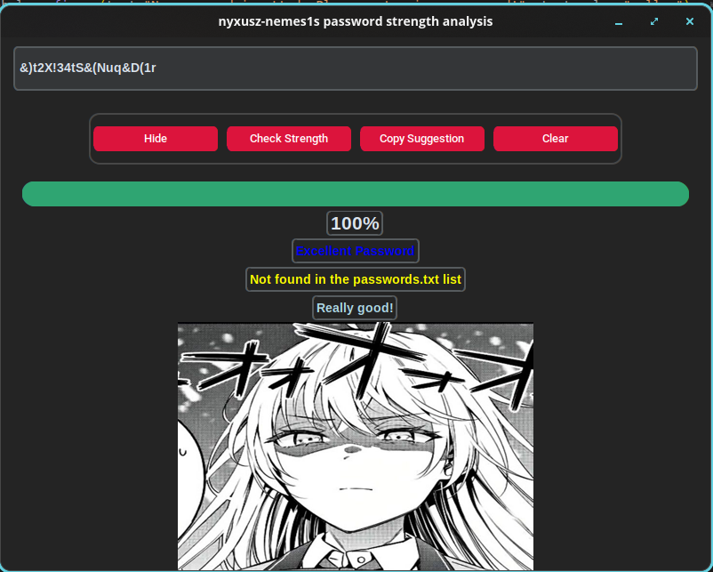

# Password Strength Checker

An application that checks password strength and flags passwords found in a known-breached password list, built with Python and CustomTkinter.

## Features

- **Strength scoring** — checks length and requires at least 3 of each character type (uppercase, lowercase, digits, symbols)
- **Breach detection** — checks entered passwords against a 100k-entry known-password list (obtained from [danielmiessler/SecLists](https://github.com/danielmiessler/SecLists))
- **Secure suggestions** — generates a fresh, random password using Python's `secrets` module (not the weaker `random` module) when your password is weak
- **GUI** — built with CustomTkinter for a clean, easy-to-use interface
- **Copy to clipboard** — one click to copy a suggested password
- **Show/hide toggle** — view your password as you type it

## Screenshot



## Installation

```bash
git clone https://github.com/nyxusz-nemes1s/Blue-Teaming/password-strength-analysis
cd Blue-Teaming/password-checker-strenght
pip install -r requirements.txt
python psc.py
```

## Requirements

- Python 3.10+
- See `requirements.txt` for dependencies

## Credits

The `passwords.txt` wordlist is the 100k-most-used-passwords list from [SecLists](https://github.com/danielmiessler/SecLists) by Daniel Miessler, used under the MIT License.

## License

This project is licensed under the MIT License — see [LICENSE](LICENSE) for details.
